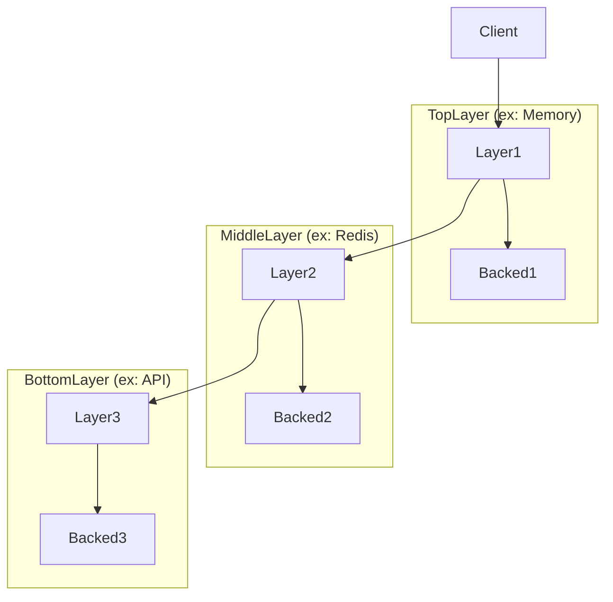

##Multi Layer Caching

```mermaid
flowchart TD
    subgraph "TopLayer (ex: Memory)"
        direction TB
        Layer1 --> Backed1
    end
    subgraph "MiddleLayer (ex: Redis)" 
        direction TB
        Layer2 --> Backed2
    end
    subgraph "BottomLayer (ex: API)"
        direction TB
        Layer3 --> Backed3
    end
Client --> Layer1
Layer1 -->  Layer2
Layer2 --> Layer3
```